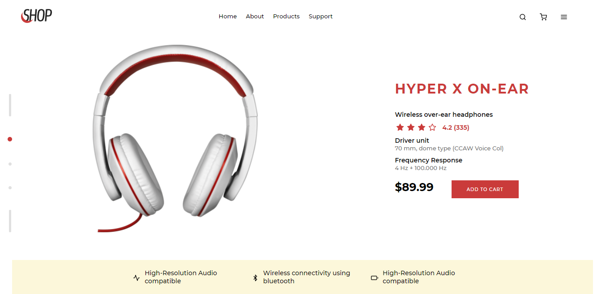
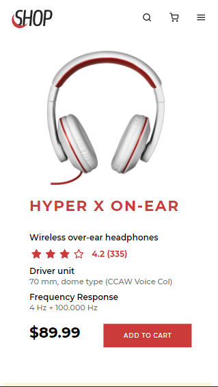

# Landing page de um fone :headphones:

Este repositório foi feito com base no desafio da DevChallenge, onde o objetivo era fazer uma landing page sobre a venda de um fone.
Segue o link do desafio no próprio site: https://devchallenge.com.br/challenges/5ee690b428a45453f9e6f311/details
Segue também o link do repositório do desafio: https://github.com/devchallenge-io/fone-landing-page

Usei para este desafio HTML5, CSS3, Javascript, como também o framework React como e a dependência react-icons para a implementação dos ícones.

## Imagem do projeto desktop: :computer:

## Imagem do projeto mobile: :iphone:

## Rodando o projeto

Para clonar o projeto, basta usar o seguinte comando:

### `git clone` + o link do repositorio

Depois de ter clonado o repositório, rode o seguinte comando para baixar todas as dependêcias do projeto:

### `npm install`

OBS: Pode ser que o projeto contenha erros dependendo da versão npm que você tem na sua máquina, para a correção de possiveis erros como esse, rode o seguinte comando: 

### `npm audit fix`

Pronto, agora é só rodar o projeto direto da sua máquina! :wink:

Use o seguinte comando:

### `npm start`
